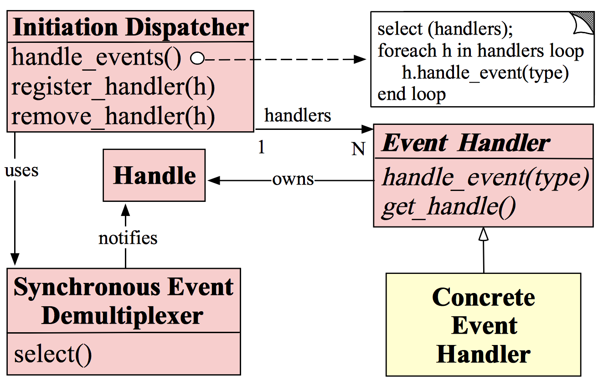

[toc]

## Reactor模式介绍

### Reactor架构图

#### Reactor模式角色

Reactor的模式角色有以下五个部分构成。

##### Handle（句柄、描述符）

本质上是一种资源，由操作系统提供的；

该资源用于表示一个个事件，比如文件描述符，或是针对网络的scoket描述符。事件既可以来自于外部也可以来自于内部；

外部事件比如说客户端的连接请求，客户端发过来的数据；内部事件比如说操作系统产生的定时事件；本质上是一个文件的描述符；

Handle是事件产生的发源地；

##### Sychronous Event Demultiplexer（同步事件分离器）

本质上是一个系统调用，用于等待事件的发生（事件可能是一个也可能是多个）；

调用方法在调用它的时候会被阻塞，一致阻塞到同步事件分发器上有事件产生为止；

对Linux来说，同步事件分发器指的就是常用的I/O多路复用，比如说select、poll、epoll等；

在java NIO中，同步事件分发器对应的组件是Selector，对应的阻塞方法时select()方法；

##### Event Handler（事件处理器）

由多个回调方法构成，这些回调方法构成了与应用相关的对于某个事件的处理反馈；

Netty相比于Java NIO 来说，在事件处理器这个角色上进行了一个升级，它为我们开发者提供了大量的回调方法，供我们在特定的事件产生时实现相应的业务逻辑处理；

##### Concrete Event Handler（具体事件处理器）

事件处理器的具体实现；实现了事件处理器的各个回调方法，从而实现了特定的逻辑；本质上就是我们所编写的一个个的处理器实现；

##### Initiation Dispatcher（初始分发器）

实际上就是Reactor角色；定义了一些规范，这些规范用于控制事件的调度方式，同时同工了应用进行事件处理器的注册、删除等措施。

是整个事件处理器非核心所在，Initiation Dispatcher 会通过同步事件分离器来等待事件的发生，一旦这个事件发生，Initiation Dispatcher 首先会分离出每个事件，然后调用事件处理器，最后调用相关的回调方法来处理这个事件；

#### Reactor模式的流程

1. 当应用向Initiation Dispatcher 注册具体处理器时，应用会标识出该事件处理器希望Initiation Dispatcher 在某个事件发生时向其通知非该事件，该事件与Handle管理；
2. Initiation Dispatcher会要求每个事件处理器向其传递内部的Handle，该Handle向操作系统标识了事件处理器；
3. 当所有事件处理器注册完毕后，应用汇调用handle_event方法来启动Initiation Dispatcher的事件循环；这时，Initiation Dispatcher会将每个注册事件管理器的Handle合并起来，并使用同步事件分发器等待这些事件的发生。比如说（TCP协议层会使用select同步事件分发器操作来等待客户端发送的数据到达连接的socket handle上）；
4. 当与某个事件源对应的Handle变为Ready状态（TCP socket变为等待读状态），同步事件分发器会通知Initiation Dispatcher；
5. Initiation Dispatcher会触发同步事件分发器的回调方法，从而响应这个处于ready状态的handle；当事件发生时，Initiation Dispatcher会被将事件源激活的Handle作为key来寻找并分发恰当的事件处理器回调方法；
6. Initiation Dispatcher会回调事件处理器的handle_event方法来执行特定的功能（netty里面的channelRead0()），从而响应这个事件。所发生的事件类型可以作为该方法参数并被该方法内部使用来执行额外的逻辑处理。